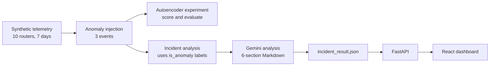

# AI Network Assistant

An AI-assisted network troubleshooting learning project with two related but currently separate workflows: a PyTorch autoencoder experiment that scores telemetry, and an incident-analysis notebook that processes synthetically injected anomaly labels. The incident results are enriched with a Gemini-generated analysis and served through FastAPI to a React dashboard. The autoencoder predictions are not currently used to create the incidents.

> **Status:** learning project, work in progress. The data is fully synthetic. See [Known limitations](#known-limitations) before reading anything into the metrics.

## Pipeline



1. **Data generation** (`scripts/generate_data.py`): synthetic telemetry for 10 routers over 7 days (2026-09-01 to 2026-09-07) at 5-minute intervals, 20,160 rows. Features: `bandwidth`, `latency`, `packet_loss`, `cpu_usage`, `memory_usage`. Random seed 42.
2. **Anomaly injection** (`scripts/03_inject_anomalies.py`): three 30-minute events (7 samples each, 21 anomalous rows, about 0.1% of the data):

   | Event | Device | Start | Effect |
   |---|---|---|---|
   | CPU overload | R-009 | 2026-09-04 10:00 | CPU 90-99% |
   | Traffic spike | R-004 | 2026-09-06 14:00 | bandwidth 90-100 |
   | Network degradation | R-006 | 2026-09-03 19:00 | bandwidth 10-20, latency 100-150 ms, packet loss 3-5% |

3. **Anomaly detection experiment** (`notebooks/02_autoencoder.ipynb`): a small PyTorch autoencoder (5-3-2-3-5, ReLU, MSE loss, Adam with lr 0.001, 100 full-batch epochs) trained on normal data only. It calculates reconstruction scores and evaluates thresholds on the labeled synthetic dataset. These predictions are not consumed by the incident-analysis notebook.
4. **Incident analysis** (`notebooks/03_incident_analysis.ipynb`): selects rows with `is_anomaly == 1` from the injected dataset and groups them by device and anomaly type. Each group gets a severity and a root-cause hypothesis from simple rules (below), plus a one-sentence evidence string built from averaged metrics. There is no time-gap or minimum-event-count rule.
5. **LLM analysis**: each incident is sent to Gemini with a constrained prompt. The model must use only the supplied telemetry, treat the root cause as a hypothesis, say so when evidence is insufficient, and suggest only safe diagnostic steps. Output is Markdown with six sections: Summary, Evidence, Likely Cause, Potential Impact, Diagnostic Recommendations, Evidence Limitation.
6. **Serving**: results are written to `data/incident_result.json` and exposed by a FastAPI backend.

### Severity and root-cause rules

Severity (on incident averages): `CRITICAL` if latency >= 100 ms or packet loss >= 3%; otherwise `HIGH` if CPU >= 90% or bandwidth >= 90; otherwise `MEDIUM`.

Root cause:

| Root cause | Rule |
|---|---|
| CPU Overload | CPU >= 90 and bandwidth < 80 |
| Traffic Spike | bandwidth >= 90 and CPU < 80 |
| Network Degradation | latency >= 100 and packet loss >= 3 and bandwidth < 30 |
| Insufficient Evidence | anything else |

## Model results

Threshold: **3.0312**, the 99.5th percentile of reconstruction error on a held-out set of normal data (calibration set). Data split (normal rows only): 16,111 train / 4,028 validation, with the validation set split again into 2,014 calibration / 2,014 test. The final test set is the 2,014 normal test rows plus all 21 anomalous rows. The scaler is fit on the training set only. Treat the reported test metrics as exploratory: a preceding threshold sweep compared candidate thresholds with labels from the full dataset, including rows later used in final test.

| Metric | Value |
|---|---|
| Precision | 0.75 |
| Recall | 1.00 |
| F1-score | 0.857 |

| | Predicted normal | Predicted anomaly |
|---|---|---|
| **Actually normal** | 2007 | 7 |
| **Actually anomaly** | 0 | 21 |

Read these numbers with the caveats below: the anomalies are synthetic, extreme, and few.

## Backend API

FastAPI app in `backend/main.py`. Data is read directly from `data/incident_result.json` (no database). CORS allows the local frontend at `http://localhost:5173` and `http://127.0.0.1:5173`.

| Method | Path | Description |
|---|---|---|
| GET | `/` | Welcome message |
| GET | `/incidents` | List all incidents |
| GET | `/incidents/{incident_id}` | One incident, `404` if it does not exist |

Incident fields (all strings): `incident_id`, `device_id`, `severity`, `anomaly_type`, `start_time`, `end_time`, `root_cause`, `evidence`, `ai_analysis` (Markdown). Timestamps are ISO strings without timezone.

Interactive docs are available at `http://127.0.0.1:8000/docs` when the server is running.

## Frontend

React + TypeScript + Vite + Tailwind CSS v4 in `frontend/`.

- [x] Project setup and CORS
- [x] API layer and incident list
- [x] Incident detail page (Markdown rendering of `ai_analysis`)
- [ ] Overview dashboard (charts, filters)
- [ ] Model performance page

## Project structure

```
AI-NETWORK-ASSISTANT/
├── backend/            # FastAPI app (main.py)
├── frontend/           # React + Vite dashboard
├── data/               # telemetry CSVs and incident_result.json
├── notebooks/          # 01 exploration, 02 autoencoder, 03 incident analysis
├── scripts/            # data generation and anomaly injection
└── requirements.txt
```

## Getting started

Requirements: Python 3 and Node.js (LTS). Commands below are for Windows PowerShell; on macOS/Linux, activate the environment with `source .venv/bin/activate`.

**1. Install Python dependencies**

```powershell
python -m venv .venv
.\.venv\Scripts\Activate.ps1
pip install -r requirements.txt
```

**2. Run the backend**

```powershell
cd backend
python -m uvicorn main:app --reload --host 127.0.0.1 --port 8000
```

**3. Run the frontend** (in a second terminal)

```powershell
cd frontend
npm install
npm run dev
```

Open `http://localhost:5173`.

**Reproducing the pipeline (optional)**

The two scripts use different relative paths. From the project root, generate the normal dataset, then run the injection script from `scripts/`:

```powershell
python scripts/generate_data.py
Push-Location scripts
python 03_inject_anomalies.py
Pop-Location
```

Notebook code reads data using paths relative to `notebooks/`; run its kernel with `notebooks/` as the working directory. Run `notebooks/02_autoencoder.ipynb` for the model experiment, then `notebooks/03_incident_analysis.ipynb` to rebuild incidents. Notebook 03 contains exploratory OpenAI calls as well as Gemini calls; executing those cells sends requests to external APIs and uses their quota. Its final Gemini batch makes one request per incident. Never commit API keys or `.env` files.

## Known limitations

This is a learning project, and the numbers above should not be read as evidence of real-world performance.

- **Synthetic data, very few events.** All 21 anomalous rows come from three injected windows on three devices. Recall of 1.0 on injected, extreme anomalies is expected and does not show generalization to real network faults.
- **Precision depends on the test mix.** The test set is about 1% anomalous, while the full dataset is about 0.1%. On the full data, precision would be much lower.
- **Threshold selection.** The final threshold comes from normal calibration data only, but an earlier exploratory sweep compared a few percentiles against the labels of the whole dataset, so the final test is not fully independent.
- **Random row-wise split.** Rows close in time or from the same device can land in different subsets, so the evaluation does not establish generalization to future periods or unseen devices.
- **Rule-based RCA mirrors the injection.** The rule thresholds match the injected ranges, so the RCA is correct on this data by construction. It has not been tested on other fault patterns, and mixed patterns (for example high CPU and high bandwidth together) fall into "Insufficient Evidence".
- **Incident grouping is simplistic.** Rows are grouped by `device_id` and `anomaly_type` with no time-gap rule, which would merge separate events on the same device once more data is added.
- **No automated tests, and PyTorch weights are not seeded**, so results are not exactly reproducible.
- **Bandwidth has no unit** in the telemetry, so none is shown in the UI.

## Roadmap

- [ ] Build incidents from autoencoder predictions with a time-gap rule and a minimum event count
- [ ] Generate more varied anomalies (different intensities, subtle and mixed patterns)
- [ ] Time-based train/validation/test split and a threshold chosen on validation data only
- [ ] Analyze the 7 false positives in the final test
- [ ] Seed PyTorch, add basic tests, clean up notebook 01
- [ ] Richer API (filters, stats, per-incident metrics) and a full dashboard

## Author

[@faizcahyadi](https://github.com/faizcahyadi)
